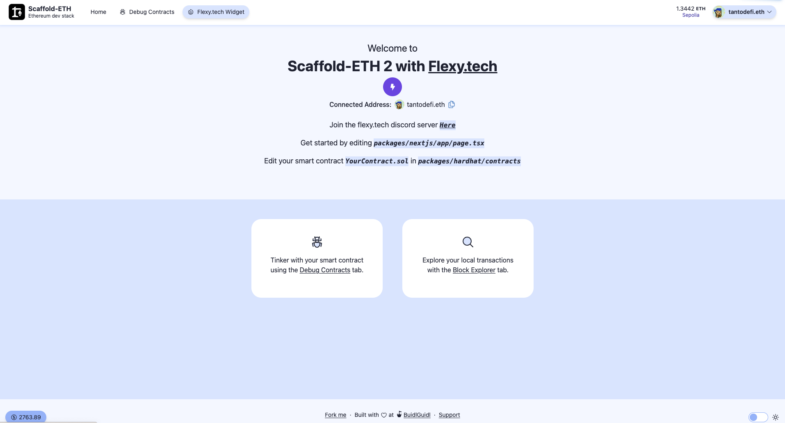

# Flexy.tech extension
 



This Scaffold-ETH 2 extension comes pre-configured with [flexy.tech](https://flexy.tech/), providing an example to help you get started quickly. Follow the steps below to set up and start using the extension.

## Installation

1. Create a new project with the flexy.tech extension:

```bash
npx create-eth@latest -e tantodefi/flexy-extension
```

## Documentation

For more detailed information and usage visit: https://docs.gasbot.xyz/for-developers/installation

## Notes

- follow flexy on [x/twitter](https://twitter.com/FlexyBridge)
- follow me on [x/twitter](https://x.com/tantodefi)
